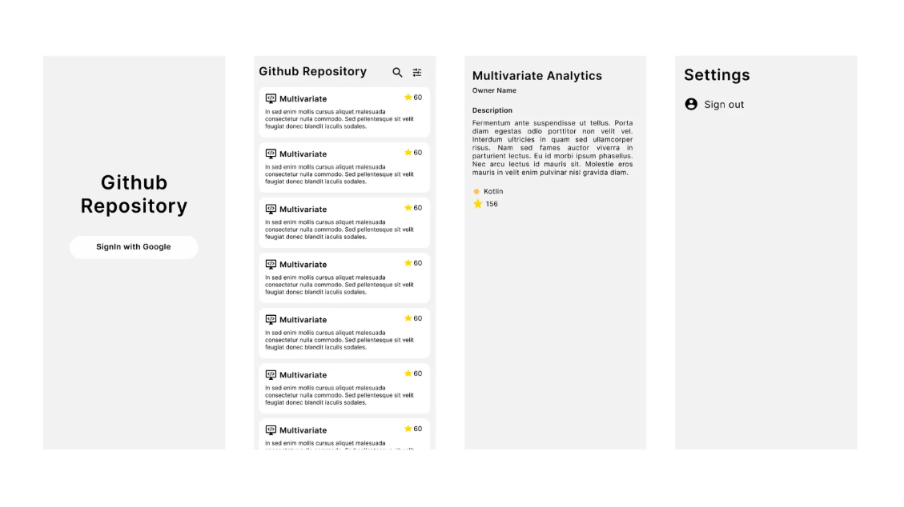

# Ghithub Repo

## Project Overview

**Ghithub Repo** is a simple Android app to view, search, and cache GitHub repositories for a logged-in user, following modern Android best practices.

## 1. Functionality

- **Google Sign-In** using **Firebase Authentication**.
- **Fetch and display GitHub repositories** for the authenticated user.
- **Repository details** include:
  - Name
  - Description
  - Starred Count
  - Language 
- **Search functionality** to quickly find a repository by name.
- **Offline caching** of repositories using **Room Database**.
- Handles loading, success, and error states gracefully.

## 2. Components Used

- **XML Layouts** for UI
- **ViewBinding** For safer and easier access to XML views.
- **ViewModel** Manages data for UI and handles business logic.
- **LiveData** To observe API and Database responses reactively.
- **Kotlin Coroutines** for asynchronous programming
- **Retrofit** for REST API calls
- **Room Database** for local storage

## 3. Architecture Used and Why

The app follows the **MVVM (Model-View-ViewModel)** architecture:

- **Model**: Represents GitHub repositories.
- **ViewModel**: Handles business logic and exposes LiveData to the UI.
- **Repository**: Abstracts data operations from the network and local database.
- **View (Activity)**: Observes LiveData and displays data accordingly.

**Why MVVM?**
- Separation of concerns.
- Better lifecycle handling.
- Easier to test and maintain.
- Cleaner and scalable project structure.

Additionally, the Repository Pattern is used to:

- Manage different data sources (remote API and local database) cleanly.
- Allow ViewModel to be unaware of whether data comes from the network or cache.

## 4.  How We Ensure the Code is Testable

- Business logic is centralized inside the ViewModel.
- Repository pattern ensures separation of concerns.
- Single Responsibility Principle: Each class has a clear, single responsibility, which makes unit testing easy.

## How to Run the Project

1. Clone this repository.
2. Open the project in **Android Studio**.
3. Connect your **Firebase Project** and configure **Google Sign-In**.
4. Build and run the app on an emulator or a real device.
5. Log in with Google, and your GitHub repositories will be displayed.

## 📹 Video Walkthrough

1. App Demo Video
  [https://drive.google.com/file/d/1r7--fnYUJMQFyqb4hU63FAl4lN1f6ghJ/view?usp=drive_link]

  ## 📦 APK Download

📥 [Download APK](https://drive.google.com/file/d/1fqQ_v2SZyqSFQuk-1UEJebBd3dhITuVZ/view?usp=sharing)

##  Author

- **Sharmila Mary**  

